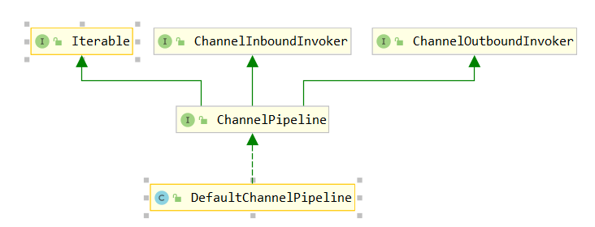

# ChannelPipeline

- 相关参考链接：https://www.cnblogs.com/qdhxhz/p/10234908.html | ChannelPipeline： https://www.jianshu.com/p/d73c5b8b0ea5 

```java
A list of ChannelHandlers which handles or intercepts inbound events and outbound operations of a Channel. 
ChannelPipeline implements an advanced form of the Intercepting Filter  pattern to give a user full control 
over how an event is handled and how the ChannelHandlers in a pipeline interact with each other.
Creation of a pipeline
Each channel has its own pipeline and it is created automatically when a new channel is created.
How an event flows in a pipeline
The following diagram describes how I/O events are processed by ChannelHandlers in a ChannelPipeline typically.
 An I/O event is handled by either a ChannelInboundHandler or a ChannelOutboundHandler and be forwarded to its 
closest handler by calling the event propagation methods defined in ChannelHandlerContext, 
such as ChannelHandlerContext.fireChannelRead(Object) and ChannelHandlerContext.write(Object).
                                                   I/O Request
                                              via Channel or
                                          ChannelHandlerContext
                                                        |
    +---------------------------------------------------+---------------+
    |                           ChannelPipeline         |               |
    |                                                  \|/              |
    |    +---------------------+            +-----------+----------+    |
    |    | Inbound Handler  N  |            | Outbound Handler  1  |    |
    |    +----------+----------+            +-----------+----------+    |
    |              /|\                                  |               |
    |               |                                  \|/              |
    |    +----------+----------+            +-----------+----------+    |
    |    | Inbound Handler N-1 |            | Outbound Handler  2  |    |
    |    +----------+----------+            +-----------+----------+    |
    |              /|\                                  .               |
    |               .                                   .               |
    | ChannelHandlerContext.fireIN_EVT() ChannelHandlerContext.OUT_EVT()|
    |        [ method call]                       [method call]         |
    |               .                                   .               |
    |               .                                  \|/              |
    |    +----------+----------+            +-----------+----------+    |
    |    | Inbound Handler  2  |            | Outbound Handler M-1 |    |
    |    +----------+----------+            +-----------+----------+    |
    |              /|\                                  |               |
    |               |                                  \|/              |
    |    +----------+----------+            +-----------+----------+    |
    |    | Inbound Handler  1  |            | Outbound Handler  M  |    |
    |    +----------+----------+            +-----------+----------+    |
    |              /|\                                  |               |
    +---------------+-----------------------------------+---------------+
                    |                                  \|/
    +---------------+-----------------------------------+---------------+
    |               |                                   |               |
    |       [ Socket.read() ]                    [ Socket.write() ]     |
    |                                                                   |
    |  Netty Internal I/O Threads (Transport Implementation)            |
    +-------------------------------------------------------------------+
```

- 我们可以在pipeline里面添加一些处理器，pipeline到时候会一一的调用他们

- 类图



- 创建时间:创建Channel时在其子类AbstractChannel中完成的
```java
    protected AbstractChannel(Channel parent) {
        this.parent = parent;
        id = newId();
        unsafe = newUnsafe();
        pipeline = newChannelPipeline();
    }
```
- ChannelPipeline使用的Filter模式把请求和响应的Filter分开了，不像Servlet中的Filter既要处理进来的数据也要处理出去的数据
- ChannelPipeLine里面是多个`channelhandlercontext`，每个`channelhandlercontext`里面包含`channelHandler`
 channelHandler分为`InBound`事件或者`outBound`
