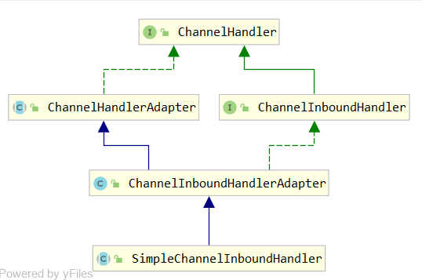

# ChannelHandler
- `SimpleChannelInboundHandler`与`ChannelInboundHandlerAdapter`的区别，在实际开发中我们该使用哪一个

    - SimpleChannelInboundHandler可以使用泛型指定数据类型，使用的时候无需转型，而ChannelInboundHandlerAdapter则没有泛型
    - SimpleChannelInboundHandler对channelRead(ChannelHandlerContext ctx, Object msg) 方法使用模板方法模式进行了实现，
    并且自动释放资源
 ```java
    @Override
    public void channelRead(ChannelHandlerContext ctx, Object msg) throws Exception {
        boolean release = true;
        try {
            if (acceptInboundMessage(msg)) {
                @SuppressWarnings("unchecked")
                I imsg = (I) msg;
                channelRead0(ctx, imsg);
            } else {
                release = false;
                ctx.fireChannelRead(msg);
            }
        } finally {
            if (autoRelease && release) {
                //使用引用计数法释放资源
                ReferenceCountUtil.release(msg);
            }
        }
    }
```
- 类结构

