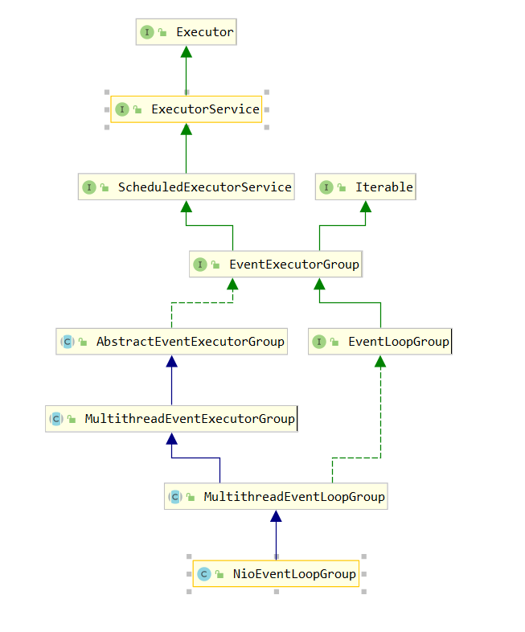

# Netty源码解读
- 从HTTP说起有了Netty，你可以实现自己的HTTP服务器，FTP服务器，UDP服务器，RPC服务器，WebSocket服务器，Redis的Proxy服务器，MySQL的Proxy服务器等等。我们回顾一下传统的HTTP服务器的原理
1. 创建一个ServerSocket，监听并绑定一个端口 
2. 一系列客户端来请求这个端口 
3. 服务器使用Accept，获得一个来自客户端的Socket连接对象
4. 启动一个新线程处理连接

    - 读Socket，得到字节流 
    - 解码协议，得到Http请求对象 
    - 处理Http请求，得到一个结果，封装成一个HttpResponse对象 
    - 编码协议，将结果序列化字节流写Socket，将字节流发给客户端 
    
5. 继续循环步骤3HTTP服务器之所以称为HTTP服务器，是因为编码解码协议是HTTP协议，如果协议是Redis协议，那它就成了Redis服务器，如果协议是WebSocket，那它就成了WebSocket服务器，等等。
使用Netty你就可以定制编解码协议，实现自己的特定协议的服务器。

- **每一个Netty程序都遵循了如下的套路**
```java
 public static void main(String[] args) {
        //创建两个线程循环工作组,一个用于接收请求,一个用于处理请求
        //NioEventLoopGroup通常都会创建该类的实例对象，可以在其构造方法中传入创建的线程数
         /*
            如果没有指定线程数将会默认创建处理器核心数超线程*2
               static {
                    DEFAULT_EVENT_LOOP_THREADS = Math.max(1, SystemPropertyUtil.getInt(
                            "io.netty.eventLoopThreads", NettyRuntime.availableProcessors() * 2));
            
                    if (logger.isDebugEnabled()) {
                        logger.debug("-Dio.netty.eventLoopThreads: {}", DEFAULT_EVENT_LOOP_THREADS);
                    }
                }
           
              最终调用重载方法
                protected MultithreadEventExecutorGroup(int nThreads, Executor executor,
                                                         EventExecutorChooserFactory chooserFactory, Object... args) {
                     if (nThreads <= 0) {
                         throw new IllegalArgumentException(String.format("nThreads: %d (expected: > 0)", nThreads));
                     }
             
                     if (executor == null) {
                        ThreadPerTaskExecutor中用到了命令模式和代理模式
                         executor = new ThreadPerTaskExecutor(newDefaultThreadFactory());
                     }
             
                     children = new EventExecutor[nThreads];
             
               ....
                 }
         */
        EventLoopGroup bossGroup = new NioEventLoopGroup();

        EventLoopGroup workGroup = new NioEventLoopGroup();

        try {
            ServerBootstrap bootstrap = new ServerBootstrap();
            bootstrap.group(bossGroup, workGroup).channel(NioServerSocketChannel.class).childHandler(new HelloWorldChannelInitializer());
            ChannelFuture channelFuture = bootstrap.bind(8080).sync();
            channelFuture.channel().closeFuture().sync();
        } catch (Exception e) {
            e.printStackTrace();
        } finally {
            bossGroup.shutdownGracefully();
            workGroup.shutdownGracefully();
        }
    }

```

- 首先 `EventLoopGroup`接口开始
    - `EventLoopGroup`继承了`EventExecutorGroup`
    
  
```
   public interface EventLoopGroup extends EventExecutorGroup {
      /*返回下一个事件循环组*/
       @Override
       EventLoop next();
         /*将传进来的Channel注册到事件循环当中，并返回一个用来判断是否注册成功了*/
       ChannelFuture register(Channel channel);
   
       ChannelFuture register(ChannelPromise promise);
         /*已经废弃 ChannelPromise中已经包含Channel多次一举*/
       @Deprecated
       ChannelFuture register(Channel channel, ChannelPromise promise);
   }

-------------------------------------------------------------------------------------------------------------------

public final class ThreadPerTaskExecutor implements Executor {
    private final ThreadFactory threadFactory;

    public ThreadPerTaskExecutor(ThreadFactory threadFactory) {
        if (threadFactory == null) {
            throw new NullPointerException("threadFactory");
        }
        this.threadFactory = threadFactory;
    }

    //此处使用到了命令模式
    @Override
    public void execute(Runnable command) {
        //这儿用到了代理模式，本来应该时该类自己的对象调用的，此处是线程工厂来调用的
        threadFactory.newThread(command).start();
    }
}
```
- 
```java
/*
 An object that executes submitted {@link Runnable} tasks. This
 * interface provides a way of decoupling task submission from the
 * mechanics of how each task will be run, including details of thread
 * use, scheduling, etc.  An {@code Executor} is normally used
 * instead of explicitly creating threads. For example, rather than
 * invoking {@code new Thread(new(RunnableTask())).start()} for each
 * of a set of tasks
 * 这个接口的思想就是把执行任务的线程和任务解耦的一种编程思想，而不是简单的创建一个线程然后在run方法中写需要执行的任务，然后直接.start启动线程
*/
public interface Executor {
    
    void execute(Runnable command);
}

```
- NioEventLoopGroup类关系

