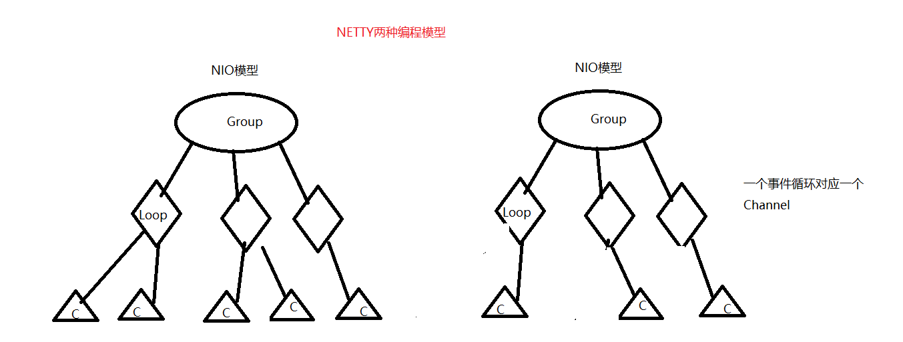
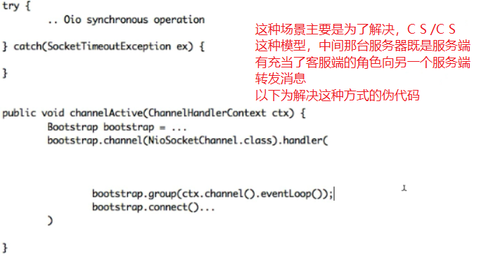

# Netty源码解读
- Netty架构原理参考：https://www.cnblogs.com/winner-0715/p/8733787.html
- 从HTTP说起有了Netty，你可以实现自己的HTTP服务器，FTP服务器，UDP服务器，RPC服务器，WebSocket服务器，Redis的Proxy服务器，MySQL的Proxy服务器等等。我们回顾一下传统的HTTP服务器的原理
1. 创建一个ServerSocket，监听并绑定一个端口 
2. 一系列客户端来请求这个端口 
3. 服务器使用Accept，获得一个来自客户端的Socket连接对象
4. 启动一个新线程处理连接

    - 读Socket，得到字节流 
    - 解码协议，得到Http请求对象 
    - 处理Http请求，得到一个结果，封装成一个HttpResponse对象 
    - 编码协议，将结果序列化字节流写Socket，将字节流发给客户端 
    
5. 继续循环步骤3HTTP服务器之所以称为HTTP服务器，是因为编码解码协议是HTTP协议，如果协议是Redis协议，那它就成了Redis服务器，如果协议是WebSocket，那它就成了WebSocket服务器，等等。
使用Netty你就可以定制编解码协议，实现自己的特定协议的服务器。

- **每一个Netty程序都遵循了如下的套路**
```java
 public static void main(String[] args) {
        //创建两个线程循环工作组,一个用于接收请求,一个用于处理请求
        //NioEventLoopGroup通常都会创建该类的实例对象，可以在其构造方法中传入创建的线程数
         /*
            如果没有指定线程数将会默认创建处理器核心数超线程*2
               static {
                    DEFAULT_EVENT_LOOP_THREADS = Math.max(1, SystemPropertyUtil.getInt(
                            "io.netty.eventLoopThreads", NettyRuntime.availableProcessors() * 2));
            
                    if (logger.isDebugEnabled()) {
                        logger.debug("-Dio.netty.eventLoopThreads: {}", DEFAULT_EVENT_LOOP_THREADS);
                    }
                }
           
              最终调用重载方法
                protected MultithreadEventExecutorGroup(int nThreads, Executor executor,
                                                         EventExecutorChooserFactory chooserFactory, Object... args) {
                     if (nThreads <= 0) {
                         throw new IllegalArgumentException(String.format("nThreads: %d (expected: > 0)", nThreads));
                     }
             
                     if (executor == null) {
                        ThreadPerTaskExecutor中用到了命令模式和代理模式
                         executor = new ThreadPerTaskExecutor(newDefaultThreadFactory());
                     }
             
                     children = new EventExecutor[nThreads];
             
               ....
                 }
         */
        EventLoopGroup bossGroup = new NioEventLoopGroup();

        EventLoopGroup workGroup = new NioEventLoopGroup();

        try {
            ServerBootstrap bootstrap = new ServerBootstrap();
            bootstrap.group(bossGroup, workGroup).channel(NioServerSocketChannel.class).childHandler(new HelloWorldChannelInitializer());
            ChannelFuture channelFuture = bootstrap.bind(8080).sync();
            channelFuture.channel().closeFuture().sync();
        } catch (Exception e) {
            e.printStackTrace();
        } finally {
            bossGroup.shutdownGracefully();
            workGroup.shutdownGracefully();
        }
    }

```

- 首先 `EventLoopGroup`接口开始
    - `EventLoopGroup`继承了`EventExecutorGroup`
    
  
```
   public interface EventLoopGroup extends EventExecutorGroup {
      /*返回下一个事件循环组*/
       @Override
       EventLoop next();
         /*将传进来的Channel注册到事件循环当中，并返回一个用来判断是否注册成功了*/
       ChannelFuture register(Channel channel);
   
       ChannelFuture register(ChannelPromise promise);
         /*已经废弃 ChannelPromise中已经包含Channel多次一举*/
       @Deprecated
       ChannelFuture register(Channel channel, ChannelPromise promise);
   }

-------------------------------------------------------------------------------------------------------------------

public final class ThreadPerTaskExecutor implements Executor {
    private final ThreadFactory threadFactory;

    public ThreadPerTaskExecutor(ThreadFactory threadFactory) {
        if (threadFactory == null) {
            throw new NullPointerException("threadFactory");
        }
        this.threadFactory = threadFactory;
    }

    //此处使用到了命令模式
    @Override
    public void execute(Runnable command) {
        //这儿用到了代理模式，本来应该时该类自己的对象调用的，此处是线程工厂来调用的
        threadFactory.newThread(command).start();
    }
}
```
- 
```java
/*
 An object that executes submitted {@link Runnable} tasks. This
 * interface provides a way of decoupling task submission from the
 * mechanics of how each task will be run, including details of thread
 * use, scheduling, etc.  An {@code Executor} is normally used
 * instead of explicitly creating threads. For example, rather than
 * invoking {@code new Thread(new(RunnableTask())).start()} for each
 * of a set of tasks
 * 这个接口的思想就是把执行任务的线程和任务解耦的一种编程思想，而不是简单的创建一个线程然后在run方法中写需要执行的任务，然后直接.start启动线程
*/
public interface Executor {
    
    void execute(Runnable command);
}

```
- NioEventLoopGroup类关系


### 关于ChannelHandlerContext.attr(..) 和 Channel.attr(..)的作用域问题

  - 参考链接：https://netty.io/wiki/new-and-noteworthy-in-4.1.html
  
 ```java
ChannelHandlerContext.attr(..) == Channel.attr(..)
Both Channel and ChannelHandlerContext implement the interface AttributeMap to enable a user to attach one or more user-defined attributes to them. 
What sometimes made a user confused was that a Channel and a ChannelHandlerContext had its own storage for the user-defined attributes.
For example, even if you put an attribute 'KEY_X' via Channel.attr(KEY_X).set(valueX),
you will never find it via ChannelHandlerContext.attr(KEY_X).get() and vice versa. This behavior is not only confusing but also is waste of memory.
  
To address this issue, we decided to keep only one map per Channel internally. AttributeMap always uses AttributeKey as its key.
 AttributeKey ensures uniqueness between each key, and thus there's no point of having more than one attribute map per Channel.
  As long as a user defines its own AttributeKey as a private static final field of his or her ChannelHandler, there will be no risk of duplicate keys.
```
- 源码中的方法
```java
 @Override
    public <T> Attribute<T> attr(AttributeKey<T> key) {
        return channel().attr(key);
    }
```
### 服务注册
```java

        @Override
        public final void register(EventLoop eventLoop, final ChannelPromise promise) {
            ...
            AbstractChannel.this.eventLoop = eventLoop;
            //此处是netty对于线程和并发的控制
            if (eventLoop.inEventLoop()) { //此处判断当前线程是否是EvenLoop中所包含的那个线程
                register0(promise);
            } else {
                try {
                    eventLoop.execute(new Runnable() {
                        @Override
                        public void run() {
                            register0(promise);
                        }
                    });
                }
        }
    //最终执行注册的方法
    @Override
    protected void doRegister() throws Exception {
        ...
        for (;;) {
            try {
                //调用Nio底层完成注册 eventLoop().unwrappedSelector() 返回Selector
                selectionKey = javaChannel().register(eventLoop().unwrappedSelector(), 0, this);
                return;
            }
            }
            ...
    }

```
# 注意：
1. 一个eventLoopGroup当中会包含一个或多个eventLoop;
2. 一个EventLoop在它的整个生命周期当中都只会与唯一一个Thread进行绑定;
3. 所有由EventLoop所处理的各种I/O事件都将在它所关联的那个Thread上进行处理;
4. 一个channel在它的整个生命周期中只会注册在一个eventLoop;
5. 一个eventLoop在运行过程当中,会被分配给一个或者多个channel，所以在ChannelHandler中一定不要做非常耗时的操作.

- 重要结论: 在Netty中, Channel的实现一定是线程安全的:若于此,我们可以存储一个channel的引用,并且在需要向远程端点发送数据时,
通过这个引用来调用channel相应的方法;即便当时有很多线程都在使用它也不会出现多线程问题;而且,消息一定会按照顺序发送出去.
- 重要结论:我们在业务开发中,不要将长时间执行的耗时任务放入别eventLoop的执行队列中,因为它将会一直阻塞该线程所对应的所有Channel上的其他执行任务,
如果我们需要进行阻塞调用或是耗时的操作(实际开发中很常见) ,那么我们就需要使用一个专门的eventExecutor (业务战程池)

- 通常会有两种实现方式:
1. 在ChannelHandler的回调方法中,使用自己定义的业务线程池,这样就可以实现异步调用.
2. 借助Netty提供的向 ChannelPipeLine 添加ChannelHandler时调用addLast()方法来传递eventExecutor
说明:默认情况下调用addLast(handler) , ChannelHandler中的回调方法都是由I/O程所执行,如果调用ChannelPipeline
addLast(EventExecutorGroup group, String name, ChannelHandler handler)方法,那么ChannelHandler中的回调方法款是由参数中的group来执行的。

### NettyNio和OIO两种编程模型图

- Nio中一个线程对应多个Channel，OIO中一个线程只对应一个Channel



- 解决C S/C S 这种情况的编码

