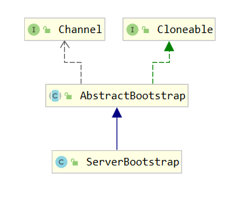

# ServerBootstrap类的源码分析
- 构造方法
```java
  public ServerBootstrap group(EventLoopGroup parentGroup, EventLoopGroup childGroup) {
        /*调用父类的构造方法给把parentGroup赋值给变量
         volatile EventLoopGroup group;//父类中申明
        */
        super.group(parentGroup);
        ObjectUtil.checkNotNull(childGroup, "childGroup");
        if (this.childGroup != null) {
            throw new IllegalStateException("childGroup set already");
        }
        this.childGroup = childGroup;
        return this;
    }
```

- 回到 `HelloWorldTestServer`这个我们自己写的类
```java
public static void main(String[] args) {
        //创建两个线程循环工作组,一个用于接收请求,一个用于处理请求
       
        EventLoopGroup bossGroup = new NioEventLoopGroup();
        EventLoopGroup workGroup = new NioEventLoopGroup();

        try {
            ServerBootstrap bootstrap = new ServerBootstrap();
            bootstrap.group(bossGroup, workGroup).channel(NioServerSocketChannel.class).childHandler(new HelloWorldChannelInitializer());
            /*前面的都是再做一些准备工作，调用bind才真正的创建实列*/
            ChannelFuture channelFuture = bootstrap.bind(8080).sync();
        /*
        Create a new {@link Channel} and bind it通过反射创建实例并绑定指定端口
        
        private ChannelFuture doBind(final SocketAddress localAddress) {
            final ChannelFuture regFuture = initAndRegister();
            final Channel channel = regFuture.channel();
            ...
        }
        
        final ChannelFuture initAndRegister() {
            Channel channel = null;
            try {
                //调用通道工厂创建实例
                channel = channelFactory.newChannel();
             ...
        }
         */
            channelFuture.channel().closeFuture().sync();
        } catch (Exception e) {
            e.printStackTrace();
        } finally {
            bossGroup.shutdownGracefully();
            workGroup.shutdownGracefully();
        }
    }
```
- ServerBootstrap的类结构



### `java.util.concurrent.Future`用于封装异步计算的结果

```java
/*
 * A {@code Future} represents the result of an asynchronous
 * computation.  Methods are provided to check if the computation is
 * complete, to wait for its completion, and to retrieve the result of
 * the computation.  The result can only be retrieved using method {@code get} 
*/
public interface Future<V> {

    boolean cancel(boolean mayInterruptIfRunning);

    boolean isCancelled();

    boolean isDone();

    V get() throws InterruptedException, ExecutionException;

    V get(long timeout, TimeUnit unit)
        throws InterruptedException, ExecutionException, TimeoutException;
}
```

- Netty提供的`io.netty.util.concurrent.Future`类更加明确了什么时候get()方法执行完毕，JDK提供的isDone()方法
```java
  /** JDK提供的isDone()方法
     * Returns {@code true} if this task completed.
     *
     * Completion may be due to normal termination, an exception, or
     * cancellation -- in all of these cases, this method will return
     * {@code true}.
     *
     * @return {@code true} if this task completed
     */
    boolean isDone();
```
    
- 所以Netty提供了`isSuccess()`
```java
 /**
     * Returns {@code true} if and only if the I/O operation was completed
     * successfully.
     */
    boolean isSuccess();
```

### `io.netty.channel.ChannelFuture`类
```java
    The result of an asynchronous Channel I/O operation.
    All I/O operations in Netty are asynchronous. It means any I/O calls will
    return immediately with no guarantee that the requested I/O operation has been completed at the end of the call. Instead,
    you will be returned with a ChannelFuture instance which gives you the information about the result or status of the I/O operation.
    A ChannelFuture is either uncompleted or completed. When an I/O operation begins, a new future object is created. 
    The new future is uncompleted initially - it is neither succeeded, failed, nor cancelled because the I/O operation is not finished yet. 
    If the I/O operation is finished either successfully, with failure, or by cancellation,
    the future is marked as completed with more specific information,
    such as the cause of the failure. Please note that even failure and cancellation belong to the completed state.

                                        +---------------------------+
                                        | Completed successfully    |
                                        +---------------------------+
                                   +---->      isDone() = true      |
   +--------------------------+    |    |   isSuccess() = true      |
   |        Uncompleted       |    |    +===========================+
   +--------------------------+    |    | Completed with failure    |
   |      isDone() = false    |    |    +---------------------------+
   |   isSuccess() = false    |----+---->      isDone() = true      |
   | isCancelled() = false    |    |    |       cause() = non-null  |
   |       cause() = null     |    |    +===========================+
   +--------------------------+    |    | Completed by cancellation |
                                   |    +---------------------------+
                                   +---->      isDone() = true      |
                                        | isCancelled() = true      |
                                        +---------------------------+
   
```
### 注意：
 - JDR所提供的Future只能通过手工方式检查执行结果,而这个操作是会阻塞的; Netty则对channel Future进行了端强,
 通过channelFutureListener以回调的方式来获取执行结果,去除了手工检查阻塞的操作;
 值得注意的是: channelFutureListener的operationComplete方法是由I/O执行的,因此阻塞的操作不要在这里执行耗时的操作,否则需要通过另外的程或线程池来执行.